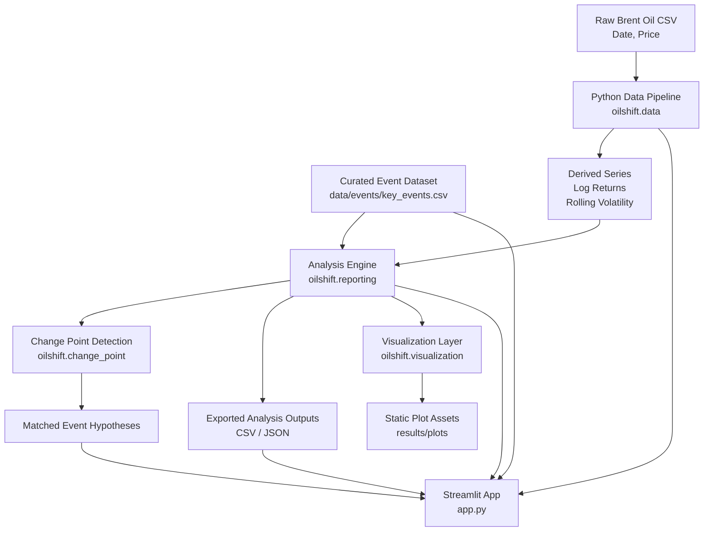
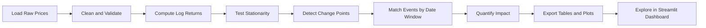

# OilShift Pro

OilShift Pro is a production-style Brent crude oil analytics project for detecting structural shifts in oil prices and linking those shifts to major geopolitical, macroeconomic, and OPEC-related events. It is designed for the 10 Academy Week 10 challenge, but structured like a professional analytics repository: Python-first, reproducible, dashboard-driven, and ready for stakeholder communication.

## Quick Launch

If you want to run the app immediately:

```powershell
python -m venv .venv
.venv\Scripts\activate
pip install -r requirements.txt
python -m streamlit run app.py
```

If your Brent CSV is not already in `data/raw/BrentOilPrices.csv`, launch the app anyway and upload the file from the sidebar.

## Executive Summary

The project answers a practical business question:

**How do major global events change Brent oil price behavior, and how can that be explained clearly to investors, policymakers, and energy decision-makers?**

OilShift Pro addresses that question through:

- Robust Python preprocessing for Brent crude price data
- Statistical change point detection on log returns
- Event matching against a curated market-events dataset
- Quantified before/after event impact analysis
- A Streamlit dashboard for interactive exploration
- Exportable CSV and plot outputs for reporting

## Key Capabilities

- Detect structural breaks in Brent oil price dynamics
- Compare detected shifts against curated geopolitical and economic events
- Measure price and volatility changes around each event window
- Generate reusable analysis artifacts from Python scripts
- Run an interactive stakeholder-facing dashboard locally
- Avoid notebook dependency in the delivery workflow

## What Stakeholders Get

- An interactive dashboard for exploring price shifts and event hypotheses
- Exportable tables for analysts and reporting teams
- Plot assets for slides, blog posts, or executive summaries
- A Python-first workflow that is easier to review, automate, and reproduce

## Business Context

Brent crude oil prices are highly sensitive to:

- OPEC production policy changes
- Wars and regional conflicts
- Economic crises and sanctions
- Demand shocks such as COVID-19
- Broader macro uncertainty

For investors, policymakers, and energy companies, these shifts affect:

- Portfolio allocation and hedging strategy
- Inflation and energy security planning
- Operational and procurement decisions
- Market risk monitoring

## Architecture



### Component Roles

| Component                | Purpose                                                                    |
| ------------------------ | -------------------------------------------------------------------------- |
| `oilshift.data`          | Validates Brent price data, normalizes dates, and computes derived series  |
| `oilshift.change_point`  | Detects structural breaks in the transformed time series                   |
| `oilshift.reporting`     | Builds stationarity checks, event associations, and export-ready summaries |
| `oilshift.visualization` | Produces Python-generated plots for reporting and reuse                    |
| `app.py`                 | Serves the Streamlit dashboard for stakeholder exploration                 |
| `scripts/`               | Provides CLI entrypoints for preprocessing, reporting, and full builds     |

## Workflow



## Repository Structure

```text
OilShift/
|-- app.py
|-- data/
|   |-- events/
|   |   `-- key_events.csv
|   |-- processed/
|   `-- raw/
|-- oilshift/
|   |-- __init__.py
|   |-- change_point.py
|   |-- data.py
|   |-- reporting.py
|   `-- visualization.py
|-- results/
|   |-- analysis/
|   |-- plots/
|   `-- summary_table.csv
|-- scripts/
|   |-- build_analysis.py
|   |-- change_point_model.py
|   |-- data_preprocessing.py
|   `-- generate_report_assets.py
|-- .github/
|   `-- workflows/
|-- requirements.txt
`-- requirements-bayesian.txt
```

## Tech Stack

- Python
- Pandas
- NumPy
- Statsmodels
- Matplotlib
- Seaborn
- Plotly
- Streamlit
- Optional: PyMC and ArviZ for Bayesian experiments

## Data

### Primary Dataset

Brent crude oil daily prices:

- Coverage: **May 20, 1987 to September 30, 2022**
- Required columns:
  - `Date`
  - `Price`

### Event Dataset

The repository includes a curated event file:

- `data/events/key_events.csv`

This file contains major events such as:

- OPEC production decisions
- Global financial crisis shocks
- Sanctions and war-related disruptions
- COVID-19 demand collapse
- Russia-Ukraine conflict

## Methodology

### 1. Data Preparation

The preprocessing layer:

- standardizes dates
- coerces prices to numeric values
- removes invalid rows
- removes duplicate dates
- computes log returns
- computes 30-day rolling volatility

### 2. Statistical Framing

Because Brent price levels are typically non-stationary, the structural break workflow focuses on **log returns** rather than raw prices for detection.

Stationarity checks use the **Augmented Dickey-Fuller test** for:

- raw price series
- transformed log return series

### 3. Change Point Detection

The default production workflow uses an offline Gaussian segmentation approach to detect structural breaks in the return series.

Optional Bayesian experimentation is supported through PyMC when installed locally.

### 4. Event Association

Detected break dates are matched to the nearest curated event inside a configurable tolerance window. These associations are **hypothesis-generating**, not definitive proof of causation.

### 5. Impact Quantification

For each event, the project measures:

- average price before the event
- average price after the event
- percentage price shift
- volatility before the event
- volatility after the event

## How To Run

### App Run Path

For most users, this is the shortest path:

```powershell
python -m venv .venv
.venv\Scripts\activate
pip install -r requirements.txt
python -m streamlit run app.py
```

Then upload your Brent dataset from the app sidebar, or place it at `data/raw/BrentOilPrices.csv`.

### 1. Create and activate a virtual environment

```powershell
python -m venv .venv
.venv\Scripts\activate
```

### 2. Install dependencies

```powershell
pip install -r requirements.txt
```

Optional Bayesian extras:

```powershell
pip install -r requirements-bayesian.txt
```

### 3. Add the Brent price dataset

Create the raw data folder if needed and place your dataset here:

```text
data/raw/BrentOilPrices.csv
```

Expected schema:

```text
Date,Price
20-May-87,18.63
21-May-87,18.45
...
```

Note: local datasets and generated files under `data/` are ignored by Git, except for the tracked event reference file.

### 4. Build the full analysis bundle

```powershell
python scripts/build_analysis.py --price-data data/raw/BrentOilPrices.csv
```

This generates:

- cleaned data in `data/processed/`
- analysis tables in `results/analysis/`
- plot assets in `results/plots/`

### 5. Generate report assets only

```powershell
python scripts/generate_report_assets.py --price-data data/raw/BrentOilPrices.csv
```

Use this when you want fresh plots and summary outputs without opening the app.

### 6. Run the Streamlit dashboard

```powershell
python -m streamlit run app.py
```

Then open the local URL shown in the terminal, usually:

```text
http://localhost:8501
```

If no local CSV is present, the app can still run and accept an uploaded file from the sidebar.

## Dashboard Overview

The Streamlit app includes:

### Overview

- historical Brent price trend
- 30-day rolling volatility
- stationarity summary
- core descriptive metrics

### Change Points

- detected structural break dates
- before/after return and price comparisons
- nearest event hypotheses

### Event Explorer

- event-centered price windows
- before/after average price comparison
- estimated impact summary

### Method Notes

- interpretation guidance
- assumptions and limitations
- correlation versus causation framing

## Communication Format

This repository supports multiple stakeholder communication modes:

- Dashboard exploration for analysts and decision-makers
- CSV exports for further modeling or audit trails
- Static plots for presentations and formal reporting
- Written narrative outputs such as blog posts, reports, or policy briefs

## Output Artifacts

Typical generated outputs include:

- `data/processed/brent_oil_prices_cleaned.csv`
- `data/processed/log_returns.csv`
- `results/analysis/change_points.csv`
- `results/analysis/change_point_event_matches.csv`
- `results/analysis/event_impacts.csv`
- `results/analysis/summary.json`
- `results/analysis/summary_table.csv`
- `results/plots/raw_price_trend.png`
- `results/plots/log_returns.png`
- `results/plots/volatility.png`
- `results/plots/price_with_events.png`

## Example Commands

Preprocess only:

```powershell
python scripts/data_preprocessing.py --price-data data/raw/BrentOilPrices.csv
```

Run change point analysis only:

```powershell
python scripts/change_point_model.py --price-data data/raw/BrentOilPrices.csv
```

Build a custom output bundle:

```powershell
python scripts/build_analysis.py `
  --price-data data/raw/BrentOilPrices.csv `
  --analysis-output results/analysis `
  --plots-output results/plots `
  --max-change-points 4 `
  --min-segment 90
```

## Assumptions and Limitations

- Change points indicate statistical shifts, not proven causal mechanisms.
- Event matching is based on temporal proximity and expert interpretation.
- Price levels can remain non-stationary even when returns are suitable for modeling.
- Results depend on the completeness and quality of the source Brent dataset.
- The bundled event list is curated and useful, but not exhaustive.

## Why This Repo Is Python-First

This repository is intentionally delivered without a notebook-based dependency in the main workflow.

All core tasks are scriptable:

- preprocessing
- change point analysis
- report generation
- dashboard delivery

That makes the project easier to:

- review in Git
- automate in CI
- deploy or extend later
- reproduce on another machine

## Recommended Stakeholder Deliverables

- Interactive dashboard for exploration
- Written report or blog post for narrative insight
- Slide deck for policy or executive review
- CSV exports for analyst follow-up work

## Troubleshooting

- If the app cannot find local price data, upload the CSV from the sidebar.
- If `streamlit` is not on PATH, use `python -m streamlit run app.py`.
- If you want the PyMC path, install `requirements-bayesian.txt`.
- If Git blocks local datasets, keep them under `data/raw/` as intended and let `.gitignore` handle them.

## Roadmap

- Add richer multi-break Bayesian modeling
- Add forecast and scenario analysis modules
- Add downloadable dashboard exports
- Add automated tests for data validation and reporting
- Add containerized local deployment

## License

Use this repository for academic, portfolio, or internal demonstration work unless your organization requires a different license model.
contact me for collaborating @abduvaio@gmail.com.
